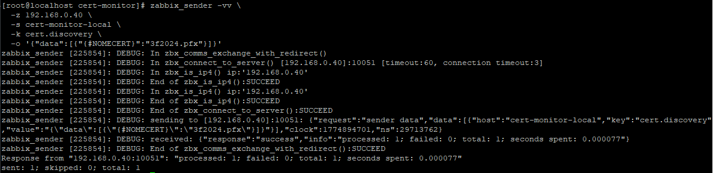
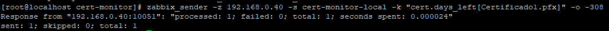
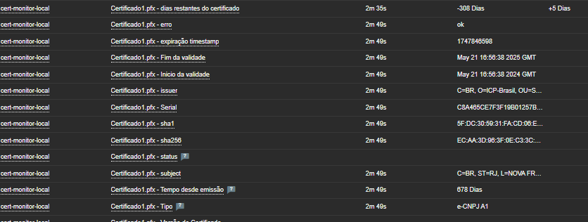
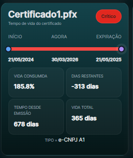

# certificate_monitoring
Monitorando validade de certificados A1 LLD, container Docker executando script shell para coletar as métricas do certificados e enviar para o Zabbix e exibir no Grafana.


## Arquitetura

Crontab → Docker → Script (OpenSSL) → Certificados → Zabbix → Grafana → HTML Cards

Dependências: OpenSSL

Exemplo:
````
openssl s_client -servername www.site.com -connect www.site.com:443
````

----------------------

## Estrutura

````
cert-monitor/
├── certs/                  # Certificados .pfx
├── scripts/
│   └── send_certs.sh       # Script para coleta e envio ao Zabbix
├── docker/
│   └── Dockerfile          # Container do monitor
````

### FLUXO:

````
CRON executa o container
   ↓
Docker cria container
   ↓
Script roda (openssl + zabbix_sender)
   ↓
Dados enviados ao Zabbix
   ↓
Script termina
   ↓
Container morre (--rm)
````

---------------------------------

Arquivo de senhas
````
nano /cert-monitor/secrets/pfx_passwords
````

Exemplo:
````
certificado1.pfx=SENHA
certificado2.pfx=SENHA
````

Permissão
````
chmod 600 /cert-monitor/secrets/pfx_passwords
````

----------------------


### Crontab

O Container será executado a cada 6h, ele irá ser criado, listar os certificados, enviar as métricas e morrer.

`````
crontab -e
`````

`````
0 8 * * * cd /cert-monitor && docker compose run --rm cert-monitor >/dev/null 2>&1
`````


Subindo o container
````
cd /DOCKER/cert-monitor
docker compose up -d --build
````

Subindo LLD cert.discovery
````
zabbix_sender -vv \
  -z 192.168.0.40 \
  -s cert-monitor-local \
  -k cert.discovery \
  -o '{"data":[{"{#NOMECERT}":"3f2024.pfx"}]}'
````




-----------------------------------

## Zabbix

Teste a coleta dos itens manualmente com o Zabbix Sender.
````
zabbix_sender -z 192.168.0.40 -s cert-monitor-local -k "cert.days_left[Nome_do_Certificado.pfx]" -o -308
zabbix_sender -z 192.168.0.40 -s cert-monitor-local -k "cert.expiry_ts[Nome_do_Certificado.pfx]" -o 1716310598
zabbix_sender -z 192.168.0.40 -s cert-monitor-local -k "cert.subject[Nome_do_Certificado.pfx]" -o "teste subject"
zabbix_sender -z 192.168.0.40 -s cert-monitor-local -k "cert.issuer[Nome_do_Certificado.pfx]" -o "teste issuer"
zabbix_sender -z 192.168.0.40 -s cert-monitor-local -k "cert.serial[Nome_do_Certificado.pfx]" -o "ABC123"
zabbix_sender -z 192.168.0.40 -s cert-monitor-local -k "cert.not_after[Nome_do_Certificado.pfx]" -o "May 21 2025"
zabbix_sender -z 192.168.0.40 -s cert-monitor-local -k "cert.sha256[Nome_do_Certificado.pfx]" -o "HASH"
zabbix_sender -z 192.168.0.40 -s cert-monitor-local -k "cert.status[Nome_do_Certificado.pfx]" -o 0
zabbix_sender -z 192.168.0.40 -s cert-monitor-local -k "cert.error[Nome_do_Certificado.pfx]" -o ""
````



Front do Zabbix




# Grafana - Dashboard


